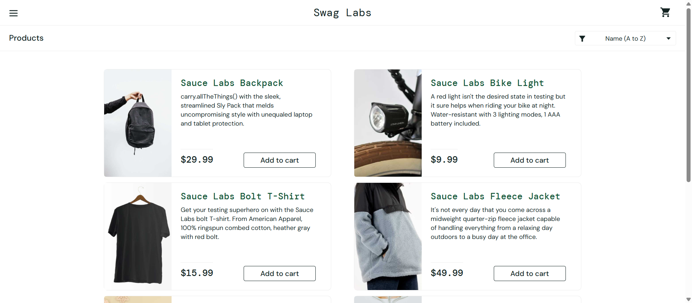
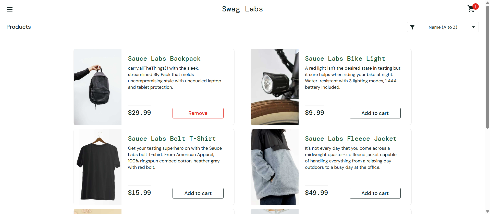
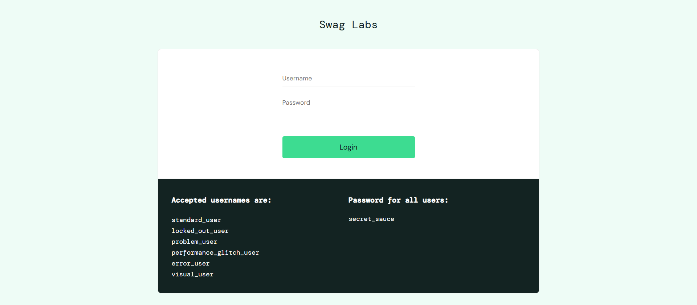

# 🚀 BÁO CÁO KẾT QUẢ KIỂM THỬ TỰ ĐỘNG UI (WEB AUTOMATION TESTING) BẰNG SELENIUM

## 📌 1. THÔNG TIN CHUNG
- **Môn học**: Đánh giá và kiểm thử chất lượng phần mềm
- **Tên bài tập**: Lab thực hành kiểm thử tự động với Selenium WebDriver
- **Sinh viên thực hiện**: Nguyễn Anh Đức
- **Mã sinh viên**: 23010650

---

## 📚 2. CƠ SỞ LÝ THUYẾT VỀ AUTOMATION TESTING VÀ SELENIUM

### 2.1. Kiểm thử tự động (Automation Testing) là gì?
Kiểm thử tự động là quá trình sử dụng các công cụ phần mềm hoặc các kịch bản mã nguồn (Scripts) độc lập để thực thi một chuỗi các bước kiểm thử phần mềm một cách tự động, thay thế cho thao tác nhấp chuột và nhập liệu thủ công của con người. Giải pháp này giúp tăng tốc độ kiểm thử lặp đi lặp lại (Regression Testing) và đảm bảo độ chính xác vượt trội.

### 2.2. Giới thiệu công cụ Selenium WebDriver
Selenium là bộ khung công cụ (Framework) mã nguồn mở mạnh mẽ nhất hiện nay phục vụ cho việc kiểm thử tự động các ứng dụng giao diện web. Trong đó, Selenium WebDriver hoạt động như một thành phần trung gian, gửi các lệnh trực tiếp điều khiển trình duyệt (Chrome, Firefox, Edge) thực thi các tác vụ mô phỏng giống hệt hành vi thực tế của người dùng cuối.

---

## ⚙️ 3. MÔI TRƯỜNG VÀ KỊCH BẢN KIỂM THỬ KỸ THUẬT

### 3.1. Cấu hình môi trường phát triển
- **Ngôn ngữ lập trình**: Python 3.x
- **Thư viện lõi**: `selenium` thư viện chính thức kết hợp với `webdriver-manager` để quản lý Driver tự động.
- **Website mục tiêu thử nghiệm**: Hệ thống mua sắm giả lập tiêu chuẩn `https://www.saucedemo.com/`

### 3.2. Danh sách kịch bản kiểm thử (Test Cases)

| Mã TC | Tên Kịch Bản | Các Bước Thực Hiện | Kết Quả Kỳ Vọng (Expected) |
| :--- | :--- | :--- | :--- |
| **TC-01** | Login Success | Truy cập hệ thống, điền user/password hợp lệ, bấm đăng nhập. | Điều hướng thành công vào trang sản phẩm `inventory.html`. |
| **TC-02** | Add to Cart | Tìm phần tử sản phẩm Balo, bấm chọn nút "Add to cart". | Biểu tượng giỏ hàng hiển thị số lượng tăng lên là `1`. |
| **TC-03** | Logout Success | Kịch hoạt mở thanh Menu điều hướng, bấm chọn liên kết "Logout". | Tài khoản thoát ra an toàn và quay về giao diện trang đăng nhập gốc. |

---

## 📊 4. QUY TRÌNH THỰC THI VÀ HÌNH ẢNH MINH CHỨNG KẾT QUẢ

Kịch bản kiểm thử được lập trình tối ưu tích hợp chức năng chụp ảnh màn hình tự động (`driver.save_screenshot`) ngay khi các câu lệnh Assertion điều kiện chạy thành công.

### 4.1. Kết quả kiểm thử Kịch bản 1 (Đăng nhập hệ thống)
Mã nguồn tự động điền tài khoản mẫu `standard_user` và vượt qua màn hình bảo mật thành công.

### 4.2. Kết quả kiểm thử Kịch bản 2 (Thêm sản phẩm vào giỏ)
Hệ thống bắt được ID phần tử và thực hiện lệnh click chuột chính xác để cập nhật số lượng giỏ hàng trực tuyến.

### 4.3. Kết quả kiểm thử Kịch bản 3 (Đăng xuất hệ thống)
Hành vi giả lập thực hiện dọn dẹp phiên làm việc của người dùng hiện tại và đưa trình duyệt quay lại trạng thái ban đầu.

---

## 💾 5. HƯỚNG DẪN REVIEW MÃ NGUỒN (DÀNH CHO NGƯỜI CHẤM BÀI)
- Mã nguồn kiểm thử tự động của bài tập nằm tại file: `automation_test.py`

Giảng viên có thể chạy trực tiếp kịch bản trên máy cá nhân bằng cách cài đặt thư viện thông qua lệnh `pip install selenium webdriver-manager` và thực thi tệp tin bằng lệnh `python automation_test.py`. Chương trình sẽ tự khởi chạy trình duyệt Chrome local để chấm điểm trực quan.

## 📝 6. KẾT LUẬN VÀ BÀI HỌC KINH NGHIỆM
Thông qua việc hoàn thiện bài tập thực hành Selenium, sinh viên đã nắm bắt được:
- Tư duy bóc tách cấu trúc tài liệu HTML để tìm kiếm chính xác vị trí phần tử (Elements) bằng các thuộc tính như ID, Name, Class hoặc XPath.
- Kỹ năng viết mã xử lý luồng sự kiện điều khiển trình duyệt và sử dụng các câu lệnh kiểm tra điều kiện `assert` để thẩm định chất lượng ứng dụng.
- Nâng cao năng lực nghiên cứu phát triển mảng Kiểm thử tự động (Automation Testing) để đáp ứng các tiêu chuẩn công nghệ phần mềm thực tế.
